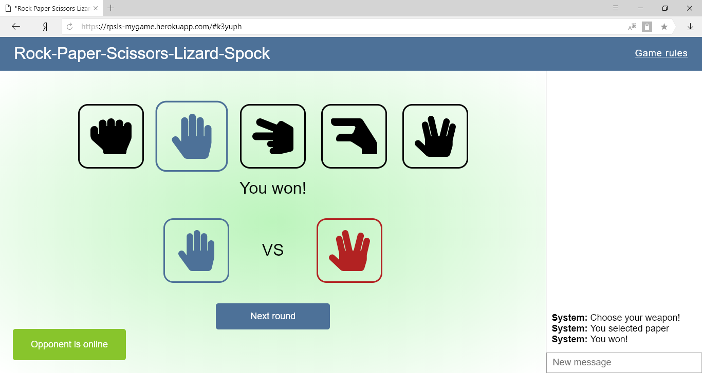

# Rock-Paper-Scissors-Lizard-Spock

## Description
"Rock-Paper-Scissors-Lizard-Spock" online multiplayer game. This is a session-based game for two players.

Link to the app: [https://rpsls-mygame.herokuapp.com](https://rpsls-mygame.herokuapp.com)


### Rules

- Scissors cuts paper
- Paper covers rock
- Rock crushes lizard
- Lizard poisons Spock
- Spock smashes scissors
- Scissors decapitates lizard
- Lizard eats paper
- Paper disproves Spock
- Spock vaporizes rock
- And as it always has – rock crushes scissors

## Features

### Session by link

The game generates you a session link. Share it with your friend to start a game session.

### Game rules

Click on the "Game rules" button in the top-right corner to see the rules.

### Choose a gesture

To choose a gesture click on the gesture icon in the game window.

### Tooltips

Each gesture is equipped with a tooltip in which the meaning of the gesture is written.

### Sounds

The beginning of the game, the choice of gestures and the result are accompanied by sounds.

### Opponent's status

The label in the bottom-left corner shows you online status of your opponent.

### Next round

When the current round ends you and your opponent need to click the "Next round" button to start a new round.

### Game chat

The game equipped with the chat where you can talk with your opponent. System messages is shown there too.

### Screenshots

#### Desktop


## Possible feature improvements

### Resposive design

Add a flexible design to play the game on mobile devices.

### Sound on messages

Add a sound on incoming messages.

### Mute sounds

Add an ability to mute all game sounds.

## How to develop
To run the project locally first you need to install the dependencies:
```
npm install
```

Then run the app server with:
```
npm run start
```
The server listens to `http://localhost:3000`.  
(You can change the port number in `server/index.js`)

To build the app run:
```
npm run watch
```

## Testing

Tests are made with [Jest](https://github.com/facebook/jest)

Run tests with:
```
npm test
```

## How to deploy
First you need to install [Heroku CLI](https://devcenter.heroku.com/articles/heroku-cli)

Then create an account on [Heroku](https://heroku.com)

On [Heroku Dashboard](https://dashboard.heroku.com/apps) create new project.

In console run:
```
heroku login
```
and enter your user credentials.

Create new repository in your project directory with:
```
git init
```
Then add Heroku remote to it:
```
heroku git:remote -a *your_project_name*
```
Finally you need to commit code to the repository and push to Heroku Git:
```
git add .
git commit -m 'Initial commit`
git push heroku master
```
Your app will be deployed to `https://*your_project_name*.herokuapp.com`

## Built with
- [React](https://github.com/facebook/react)
- [Redux](https://github.com/reduxjs/redux) - app state container
- [Express](https://github.com/expressjs/express) - web framework for node.js
- [Socket.IO](https://github.com/socketio/socket.io) - websocket framework
